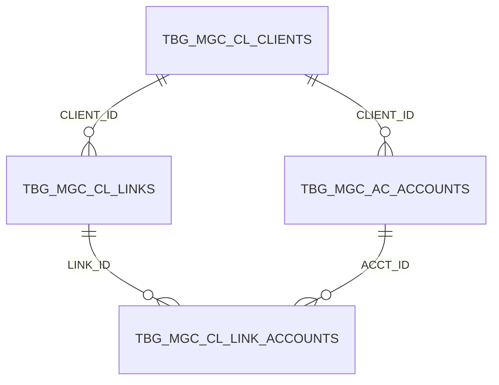
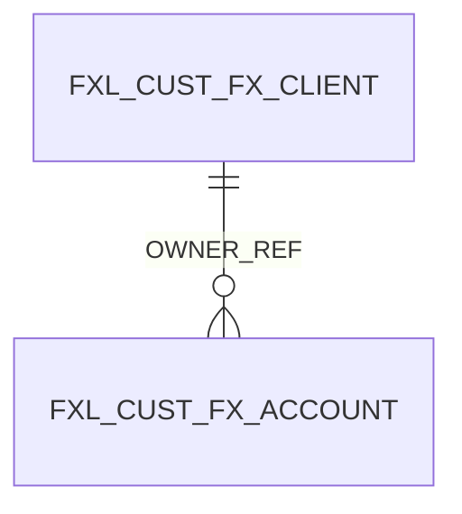

## Ключевые связи (FK) для клиентов/счетов/маппинга

Ниже — связи, которые **явно определены внешними ключами** в DDL.

### 1) Клиент → Счет (основная связь)

- **Клиенты**: `TBG.MGC_CL_CLIENTS` (PK: `CLIENT_ID`)
- **Счета**: `TBG.MGC_AC_ACCOUNTS` (PK: `ACCT_ID`)
- **FK**: `TBG.MGC_AC_ACCOUNTS.CLIENT_ID` → `TBG.MGC_CL_CLIENTS.CLIENT_ID`

### 2) Клиент ↔ Клиент и “связь” → Счет (расширенный маппинг через LINK_ID)

Это похоже на механизм связей/ролей (например, связанные лица, доверенности, совместное владение и т.п.).

- `TBG.MGC_CL_LINKS`:
  - PK: `LINK_ID`
  - FK: `CLIENT_ID` → `TBG.MGC_CL_CLIENTS.CLIENT_ID` (ON DELETE CASCADE)
  - поля: `LINKED_CLIENT_ID`, `LINK_TYPE_C` (тип связи)

- `TBG.MGC_CL_LINK_ACCOUNTS`:
  - PK: `LINK_ACCT_ID`
  - FK1: `LINK_ID` → `TBG.MGC_CL_LINKS.LINK_ID` (ON DELETE CASCADE)
  - FK2: `ACCT_ID` → `TBG.MGC_AC_ACCOUNTS.ACCT_ID`
  - назначение: “привязать” счет к конкретной связи `LINK_ID` (контекст/роль)

### 3) Витрина/каналы: клиент → счет в `FXL_CUST`

- `FXL_CUST.FX_CLIENT` (PK: `ID`)
- `FXL_CUST.FX_ACCOUNT` (PK: `ID`)
- FK: `FXL_CUST.FX_ACCOUNT.OWNER_REF` → `FXL_CUST.FX_CLIENT.ID`

## Диаграммы (Mermaid)

